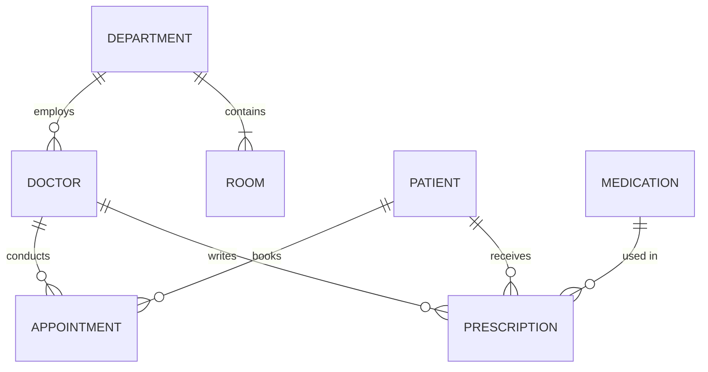
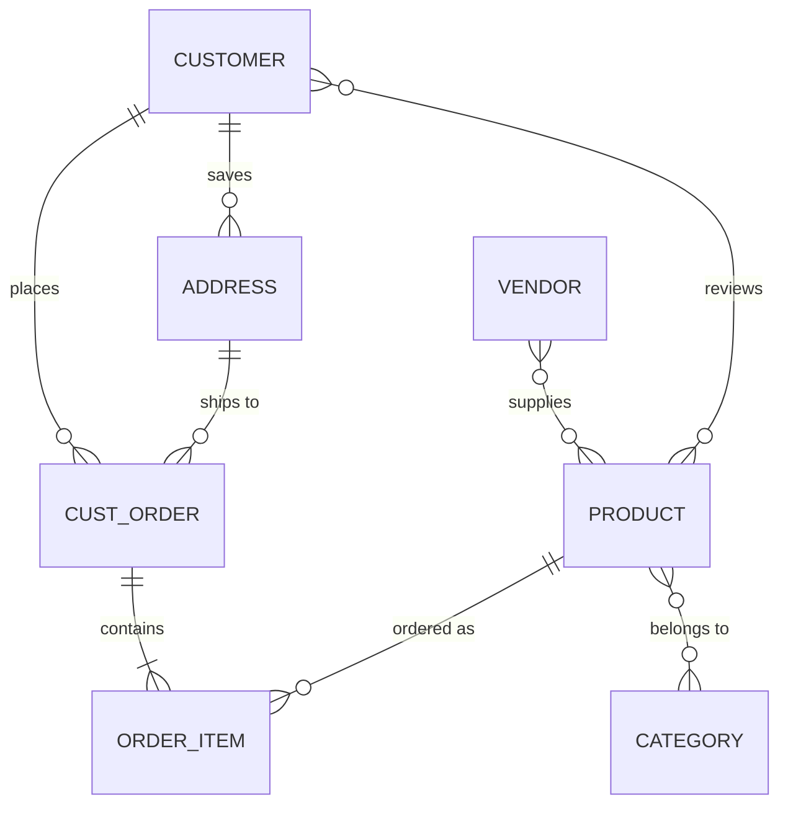
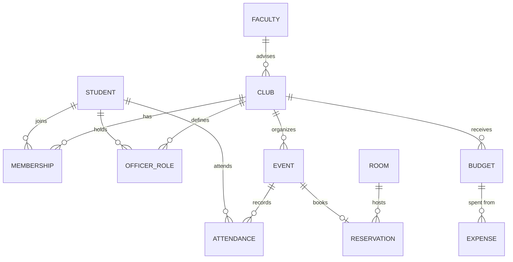

# Laboratory Work 1 — Relational Model and Keys

## Part 1. Key Identification

### Task 1.1. Relation A: Employee

`Employee(EmpID, SSN, Email, Phone, Name, Department, Salary)`

A **superkey** is any set of attributes that uniquely identifies a row. A **candidate key** is a minimal superkey: remove any attribute and it is no longer unique. Uniqueness has to hold for every legal row, not only for the three sample rows.

From the meaning of the attributes, and confirmed by the sample:

| Attribute | Unique in the sample? | Unique by definition? |
| --- | --- | --- |
| EmpID | yes | yes — employee identifier |
| SSN | yes | yes — one SSN per person |
| Email | yes | yes — company address issued to one employee |
| Phone | yes | no — the schema does not forbid sharing a phone |
| Name | yes | no — two people can have the same name |
| Department | no (`IT` appears twice) | no |
| Salary | yes | no — many employees can earn the same amount |

#### 1. Superkeys (more than six)

1. `{EmpID}`
2. `{SSN}`
3. `{Email}`
4. `{EmpID, Name}`
5. `{SSN, Department}`
6. `{Email, Phone, Salary}`
7. `{EmpID, SSN, Email}`
8. `{EmpID, SSN, Email, Phone, Name, Department, Salary}`

Any superset of `{EmpID}`, `{SSN}`, or `{Email}` is also a superkey. `{Phone}` is not a superkey, and neither is `{Name}`, `{Department}`, or `{Salary}`.

#### 2. Candidate keys

- `{EmpID}`
- `{SSN}`
- `{Email}`

Each one is unique on its own, so none of the larger superkeys is a candidate key.

#### 3. Primary key

**EmpID.**

SSN is sensitive and should not be copied into every foreign key. Email can change when a person changes name or leaves and returns. EmpID is stable, short, and assigned by the company.

#### 4. Can two employees have the same phone number?

Yes. The three sample phones happen to differ, but a sample cannot create a constraint that was not declared. `Department` already shows the difference: `IT` is stored twice, so a column can repeat. Nothing in the relation says `Phone` is unique, so two employees may share one number. That is why `{Phone}` is not a candidate key.

### Task 1.1. Relation B: Course Registration

`Registration(StudentID, CourseCode, Section, Semester, Year, Grade, Credits)`

Rules used:

- a student may take the same course again in another semester;
- a student may not register twice for the same section in the same semester;
- one section in one semester has one credit value.

#### 1. Minimum primary key

`{StudentID, CourseCode, Section, Semester, Year}`

#### 2. Why each attribute is necessary

| If this attribute is removed | Two different facts collapse into one row |
| --- | --- |
| StudentID | two students in the same section cannot be told apart |
| CourseCode | section numbers are reused by different courses |
| Section | the rule forbids the same section twice, not two different sections of one course |
| Semester | Fall and Spring of the same year are different offerings |
| Year | Fall 2024 and Fall 2025 would look identical |

`Grade` does not belong in the key. It describes the registration; it does not identify it. `Credits` does not belong either.

#### 3. Other candidate keys

There is no second candidate key. `Grade` and `Credits` are not unique, and no other subset of the five key attributes is unique under the rules above.

There is a functional dependency that is not a key of this relation:

`{CourseCode, Section, Semester, Year} → Credits`

Many students share that one credit value, so those four attributes do not identify a registration row.

### Task 1.2. Foreign keys

| Table | Foreign key | References |
| --- | --- | --- |
| Student | AdvisorID | Professor(ProfID) |
| Professor | Department | Department(DeptCode) |
| Course | DepartmentCode | Department(DeptCode) |
| Department | ChairID | Professor(ProfID) |
| Enrollment | StudentID | Student(StudentID) |
| Enrollment | CourseID | Course(CourseID) |

`Student.AdvisorID` and `Department.ChairID` both point at `Professor`. `Professor.Department` and `Course.DepartmentCode` both point at `Department`. `Department` and `Professor` refer to each other, so one of those two foreign keys has to be added after both tables exist (or inserted as NULL and filled in later).

`Enrollment(StudentID, CourseID, Semester, Grade)` has no separate surrogate. Its primary key is `{StudentID, CourseID, Semester}`, assuming one grade per student, course, and semester.

## Part 2. ER Diagrams

### Task 2.1. Hospital management system

#### Entities

| Entity | Strong or weak | Reason |
| --- | --- | --- |
| Patient | strong | identified by PatientID |
| Doctor | strong | identified by DoctorID |
| Department | strong | identified by DeptCode |
| Medication | strong | a drug exists without a particular prescription |
| Room | **weak** | room 101 in Cardiology is not room 101 in Neurology. The partial key is RoomNumber; the owner is Department |
| Appointment | associative | a visit is one patient with one doctor at one date and time |
| Prescription | associative | one doctor prescribes one medication to one patient |

#### Attributes

**Patient** (strong)

| Attribute | Kind |
| --- | --- |
| PatientID | simple, primary key |
| Name | composite: FirstName, LastName |
| BirthDate | simple |
| Age | derived from BirthDate |
| Address | composite: Street, City, State, Zip |
| Phone | multi-valued |
| Insurance | composite: Provider, PolicyNumber |

**Doctor** (strong)

| Attribute | Kind |
| --- | --- |
| DoctorID | simple, primary key |
| Name | composite: FirstName, LastName |
| Specialization | multi-valued |
| Phone | simple |
| OfficeLocation | simple |

**Department** (strong)

| Attribute | Kind |
| --- | --- |
| DeptCode | simple, primary key |
| DeptName | simple |
| Location | simple |

**Room** (weak, owner Department)

| Attribute | Kind |
| --- | --- |
| RoomNumber | simple, partial key |
| DeptCode | inherited from the owner |

**Appointment**

| Attribute | Kind |
| --- | --- |
| AppointmentDateTime | simple; part of the identity together with Patient and Doctor |
| Purpose | simple |
| Notes | simple |

**Medication**

| Attribute | Kind |
| --- | --- |
| MedicationID | simple, primary key |
| Name | simple |
| Form | simple (tablet, injection, and so on) |

**Prescription**

| Attribute | Kind |
| --- | --- |
| Dosage | simple |
| Instructions | simple |
| DatePrescribed | simple |

#### Relationships

| Relationship | Cardinality | Participation |
| --- | --- | --- |
| Department employs Doctor | 1:N | a doctor works in one department; a department has many doctors |
| Department contains Room | 1:N, identifying | every room belongs to exactly one department |
| Patient books Appointment | 1:N | an appointment is for exactly one patient |
| Doctor conducts Appointment | 1:N | an appointment is with exactly one doctor |
| Doctor writes Prescription | 1:N | a prescription has one prescribing doctor |
| Patient receives Prescription | 1:N | a prescription is for one patient |
| Medication is used in Prescription | 1:N | a prescription names one medication |

A patient sees many doctors over time, and a doctor sees many patients, so the patient–doctor link is many-to-many. Appointment is the associative entity that breaks it and stores purpose and notes. Prescription does the same for doctor, patient, and medication, and stores dosage and instructions.



`ROOM` is the weak entity. Its primary key is `(DeptCode, RoomNumber)`.

#### Relational schema

```sql
Department(
    DeptCode CHAR(10) PRIMARY KEY,
    DeptName VARCHAR(100),
    Location VARCHAR(100)
)

Doctor(
    DoctorID SERIAL PRIMARY KEY,
    FirstName VARCHAR(50),
    LastName VARCHAR(50),
    Phone VARCHAR(20),
    OfficeLocation VARCHAR(100),
    DeptCode CHAR(10) REFERENCES Department(DeptCode)
)

DoctorSpecialization(
    DoctorID INTEGER REFERENCES Doctor(DoctorID),
    Specialization VARCHAR(100),
    PRIMARY KEY (DoctorID, Specialization)
)

Patient(
    PatientID SERIAL PRIMARY KEY,
    FirstName VARCHAR(50),
    LastName VARCHAR(50),
    BirthDate DATE,
    Street VARCHAR(100),
    City VARCHAR(50),
    State CHAR(2),
    Zip VARCHAR(10),
    InsuranceProvider VARCHAR(100),
    PolicyNumber VARCHAR(30)
)

PatientPhone(
    PatientID INTEGER REFERENCES Patient(PatientID),
    Phone VARCHAR(20),
    PRIMARY KEY (PatientID, Phone)
)

Room(
    DeptCode CHAR(10) REFERENCES Department(DeptCode),
    RoomNumber VARCHAR(10),
    PRIMARY KEY (DeptCode, RoomNumber)
)

Appointment(
    PatientID INTEGER REFERENCES Patient(PatientID),
    DoctorID INTEGER REFERENCES Doctor(DoctorID),
    AppointmentAt TIMESTAMP,
    Purpose VARCHAR(200),
    Notes TEXT,
    PRIMARY KEY (PatientID, DoctorID, AppointmentAt)
)

Medication(
    MedicationID SERIAL PRIMARY KEY,
    Name VARCHAR(100),
    Form VARCHAR(30)
)

Prescription(
    PrescriptionID SERIAL PRIMARY KEY,
    PatientID INTEGER REFERENCES Patient(PatientID),
    DoctorID INTEGER REFERENCES Doctor(DoctorID),
    MedicationID INTEGER REFERENCES Medication(MedicationID),
    Dosage VARCHAR(50),
    Instructions TEXT,
    DatePrescribed DATE
)
```

`Age` is not stored. It is computed from `BirthDate`.

### Task 2.2. E-commerce platform

#### Weak entity

**OrderItem** is weak. A line has no meaning without its order: "line 2" of order 100 is not "line 2" of order 200. The owner is `Order`. The partial key is `LineNo`. The full key is `(OrderID, LineNo)`.

#### Many-to-many relationship that needs attributes

**Customer reviews Product.** The relationship has `Rating` and `ReviewText`. Those values belong to the pair (customer, product), not to either entity alone.

`OrderItem` is the other attributed link: `Quantity` and `UnitPrice` (the price at the time of the order, which must not change when the catalog price changes).

#### Other design choices

- A product belongs to many categories, and a category contains many products.
- A product can be supplied by many vendors. The supply link stores `SupplyPrice`.
- Billing address and shipping address are different rows of `Address`. The customer points at a billing address. The order points at a shipping address, so a later change to the customer's address does not rewrite an old order.
- Stock is an attribute of `Product` (`StockQuantity`). One number per product is enough for this statement. A separate `Inventory` entity would be needed only if the same product were stored in several warehouses.



#### Relational schema

```sql
Customer(
    CustomerID SERIAL PRIMARY KEY,
    FullName VARCHAR(100),
    Email VARCHAR(100) UNIQUE,
    BillingAddressID INTEGER
)

Address(
    AddressID SERIAL PRIMARY KEY,
    CustomerID INTEGER REFERENCES Customer(CustomerID),
    Street VARCHAR(100),
    City VARCHAR(50),
    State VARCHAR(50),
    Zip VARCHAR(10)
)

-- Customer.BillingAddressID REFERENCES Address(AddressID), added after both tables exist

Vendor(
    VendorID SERIAL PRIMARY KEY,
    VendorName VARCHAR(100),
    Email VARCHAR(100)
)

Category(
    CategoryID SERIAL PRIMARY KEY,
    CategoryName VARCHAR(100)
)

Product(
    ProductID SERIAL PRIMARY KEY,
    ProductName VARCHAR(150),
    ListPrice NUMERIC(10, 2),
    StockQuantity INTEGER
)

ProductCategory(
    ProductID INTEGER REFERENCES Product(ProductID),
    CategoryID INTEGER REFERENCES Category(CategoryID),
    PRIMARY KEY (ProductID, CategoryID)
)

ProductVendor(
    ProductID INTEGER REFERENCES Product(ProductID),
    VendorID INTEGER REFERENCES Vendor(VendorID),
    SupplyPrice NUMERIC(10, 2),
    PRIMARY KEY (ProductID, VendorID)
)

CustOrder(
    OrderID SERIAL PRIMARY KEY,
    CustomerID INTEGER REFERENCES Customer(CustomerID),
    ShipAddressID INTEGER REFERENCES Address(AddressID),
    OrderDate DATE,
    Status VARCHAR(20)
)

OrderItem(
    OrderID INTEGER REFERENCES CustOrder(OrderID),
    LineNo INTEGER,
    ProductID INTEGER REFERENCES Product(ProductID),
    Quantity INTEGER,
    UnitPrice NUMERIC(10, 2),
    PRIMARY KEY (OrderID, LineNo)
)

Review(
    CustomerID INTEGER REFERENCES Customer(CustomerID),
    ProductID INTEGER REFERENCES Product(ProductID),
    Rating INTEGER,
    ReviewText TEXT,
    ReviewedAt TIMESTAMP,
    PRIMARY KEY (CustomerID, ProductID)
)
```

## Part 4. Normalization

### Task 4.1. StudentProject

`StudentProject(StudentID, StudentName, StudentMajor, ProjectID, ProjectTitle, ProjectType, SupervisorID, SupervisorName, SupervisorDept, Role, HoursWorked, StartDate, EndDate)`

Assumption: one student has one role on a given project, so one row is one student–project pair.

#### 1. Functional dependencies

- `StudentID → StudentName, StudentMajor`
- `ProjectID → ProjectTitle, ProjectType, SupervisorID`
- `SupervisorID → SupervisorName, SupervisorDept`
- `ProjectID → SupervisorName, SupervisorDept` (transitive through `SupervisorID`)
- `{StudentID, ProjectID} → Role, HoursWorked, StartDate, EndDate`

#### 2. Problems

**Redundancy.** Alice's name and major are copied once per project. The website project's title, type, and supervisor are copied once per student on that project.

Sample before normalization:

| StudentID | StudentName | StudentMajor | ProjectID | ProjectTitle | SupervisorName | Role |
| --- | --- | --- | --- | --- | --- | --- |
| S1 | Alice | CS | P1 | Website | Dr. Kim | Developer |
| S1 | Alice | CS | P2 | Robot | Dr. Ng | Lead |
| S2 | Bob | CS | P1 | Website | Dr. Kim | Tester |

**Update anomaly.** Alice changes major from CS to Math. The major is stored on two rows. If only one row is updated, the database says she has two majors.

**Insert anomaly.** A new project cannot be stored until some student is assigned, because `StudentID` is part of the key and cannot be null. A supervisor cannot be stored until they own a project that already has a student.

**Delete anomaly.** If Alice is the only student on Robot and that row is deleted, the project title, type, and Dr. Ng's department disappear with her.

#### 3. First normal form

The table is already in 1NF. Every column holds one value, and there is no repeating group. It would violate 1NF only if several roles or several supervisors were packed into a single cell. They are not.

#### 4. Second normal form

Primary key: `{StudentID, ProjectID}`.

Partial dependencies (a non-key attribute depends on only part of the key):

- `StudentID → StudentName, StudentMajor`
- `ProjectID → ProjectTitle, ProjectType, SupervisorID, SupervisorName, SupervisorDept`

`Role`, `HoursWorked`, `StartDate`, and `EndDate` depend on the whole key, so they stay.

2NF decomposition:

```text
Student(StudentID, StudentName, StudentMajor)
Project(ProjectID, ProjectTitle, ProjectType, SupervisorID, SupervisorName, SupervisorDept)
Assignment(StudentID, ProjectID, Role, HoursWorked, StartDate, EndDate)
```

#### 5. Third normal form

Transitive dependency inside `Project`:

`ProjectID → SupervisorID → SupervisorName, SupervisorDept`

`SupervisorID` is not a key of `Project`, and the supervisor's name and department are not part of a key.

Final 3NF schema:

```sql
Student(
    StudentID VARCHAR(10) PRIMARY KEY,
    StudentName VARCHAR(100),
    StudentMajor VARCHAR(50)
)

Supervisor(
    SupervisorID VARCHAR(10) PRIMARY KEY,
    SupervisorName VARCHAR(100),
    SupervisorDept VARCHAR(50)
)

Project(
    ProjectID VARCHAR(10) PRIMARY KEY,
    ProjectTitle VARCHAR(150),
    ProjectType VARCHAR(50),
    SupervisorID VARCHAR(10) REFERENCES Supervisor(SupervisorID)
)

Assignment(
    StudentID VARCHAR(10) REFERENCES Student(StudentID),
    ProjectID VARCHAR(10) REFERENCES Project(ProjectID),
    Role VARCHAR(50),
    HoursWorked NUMERIC(6, 1),
    StartDate DATE,
    EndDate DATE,
    PRIMARY KEY (StudentID, ProjectID)
)
```

Every non-key attribute now depends on the key of its own table, and not on another non-key attribute. The join of these four tables reconstructs the original rows.

### Task 4.2. CourseSchedule and BCNF

`CourseSchedule(StudentID, StudentMajor, CourseID, CourseName, InstructorID, InstructorName, TimeSlot, Room, Building)`

#### 1. Primary key

`{StudentID, TimeSlot}`

A student can be in only one place in a given time slot, so that pair identifies the row. `CourseID` is a fact about that booking, not part of the key.

`{StudentID, CourseID}` is the obvious choice and it is not minimal enough to be the only answer: the schedule constraint already makes `TimeSlot` identify the student's course. `{StudentID, CourseID, TimeSlot}` is a superkey, not a candidate key, because `CourseID` can be removed.

If the university allowed a student to sit in two classes at the same time, the key would have to grow to `{StudentID, CourseID, TimeSlot}`. The rules describe a real timetable, so double-booking a student is rejected.

#### 2. Functional dependencies

From the stated rules:

- `StudentID → StudentMajor` (exactly one major)
- `CourseID → CourseName` (a course has one name)
- `InstructorID → InstructorName` (an instructor has one name)
- `Room → Building` (room numbers are unique across campus, so the room determines the building)
- `{CourseID, TimeSlot} → InstructorID, Room` (a section is one instructor, at one time, in one room; a course has at most one section in one time slot)
- `{StudentID, TimeSlot} → CourseID, CourseName, InstructorID, InstructorName, Room, Building` (the key)

`{TimeSlot, Room} → CourseID, InstructorID` is a second, reasonable scheduling rule: one room hosts one class at a time. It is used below as a second candidate key of the offering table. It is not required to prove that the original table is not in BCNF.

#### 3. Is the table in BCNF?

No. A relation is in BCNF only when the left side of every functional dependency is a superkey. These determinants are not superkeys of `CourseSchedule`:

- `StudentID`
- `CourseID`
- `InstructorID`
- `Room`
- `{CourseID, TimeSlot}`

#### 4. Decomposition to BCNF

Each step splits `R` on `X → Y` into `(X ∪ Y)` and `(R − Y)`, which keeps the join lossless.

1. `StudentID → StudentMajor`
   - `Student(StudentID, StudentMajor)`
   - remaining: `(StudentID, CourseID, CourseName, InstructorID, InstructorName, TimeSlot, Room, Building)`
2. `CourseID → CourseName`
   - `Course(CourseID, CourseName)`
   - remaining: `(StudentID, CourseID, InstructorID, InstructorName, TimeSlot, Room, Building)`
3. `InstructorID → InstructorName`
   - `Instructor(InstructorID, InstructorName)`
   - remaining: `(StudentID, CourseID, InstructorID, TimeSlot, Room, Building)`
4. `Room → Building`
   - `Room(Room, Building)`
   - remaining: `(StudentID, CourseID, InstructorID, TimeSlot, Room)`
5. `{CourseID, TimeSlot} → InstructorID, Room`
   - `Offering(CourseID, TimeSlot, InstructorID, Room)`
   - `Enrollment(StudentID, TimeSlot, CourseID)`

`Offering` has candidate key `{CourseID, TimeSlot}`. If a room cannot host two classes at once, `{TimeSlot, Room}` is a second candidate key, and that dependency does not break BCNF.

`Enrollment` has candidate key `{StudentID, TimeSlot}` and `StudentID, TimeSlot → CourseID`. The determinant is the key, so this table is in BCNF.

Final schema:

```sql
Student(
    StudentID VARCHAR(10) PRIMARY KEY,
    StudentMajor VARCHAR(50)
)

Course(
    CourseID VARCHAR(10) PRIMARY KEY,
    CourseName VARCHAR(100)
)

Instructor(
    InstructorID VARCHAR(10) PRIMARY KEY,
    InstructorName VARCHAR(100)
)

Room(
    Room VARCHAR(20) PRIMARY KEY,
    Building VARCHAR(50)
)

Offering(
    CourseID VARCHAR(10) REFERENCES Course(CourseID),
    TimeSlot VARCHAR(20),
    InstructorID VARCHAR(10) REFERENCES Instructor(InstructorID),
    Room VARCHAR(20) REFERENCES Room(Room),
    PRIMARY KEY (CourseID, TimeSlot)
)

Enrollment(
    StudentID VARCHAR(10) REFERENCES Student(StudentID),
    TimeSlot VARCHAR(20),
    CourseID VARCHAR(10),
    PRIMARY KEY (StudentID, TimeSlot),
    FOREIGN KEY (CourseID, TimeSlot) REFERENCES Offering(CourseID, TimeSlot)
)
```

#### 5. Loss of information

The decomposition does not lose facts. Every split follows a real functional dependency, so the natural join of `Enrollment`, `Offering`, `Student`, `Course`, `Instructor`, and `Room` rebuilds the original table and does not invent rows.

What changes is dependency placement, not content. `StudentID → StudentMajor` lives only in `Student`. `{CourseID, TimeSlot} → Room, InstructorID` lives only in `Offering`. A query that wants the student's major and the room must join. That is extra work, not missing data.

Information would be lost only by a bad split, for example storing `Enrollment(StudentID, CourseID)` and throwing away `TimeSlot`. Then two meetings of the same student in the same course could no longer be separated, and the join back to `Offering` would be ambiguous. The schema above keeps `TimeSlot` in both `Enrollment` and `Offering`.

## Part 5. Design Challenge — Student Clubs

### 1. ER diagram

| Entity | Notes |
| --- | --- |
| Student | strong |
| Faculty | strong. One faculty member advises many clubs |
| Club | strong. Exactly one advisor |
| Membership | student–club pair, with the date the student joined |
| OfficerRole | a student holding a named office in a club for a period of time |
| Event | belongs to one club |
| Attendance | student–event pair |
| Room | a reservable room |
| Reservation | one event occupies one room for an interval |
| Budget | one allocation per club per fiscal year |
| Expense | a single spend against a budget |



### 2. Relational schema

```sql
Student(
    StudentID SERIAL PRIMARY KEY,
    FirstName VARCHAR(50),
    LastName VARCHAR(50),
    Email VARCHAR(100) UNIQUE,
    Major VARCHAR(50)
)

Faculty(
    FacultyID SERIAL PRIMARY KEY,
    FullName VARCHAR(100),
    Department VARCHAR(50),
    Email VARCHAR(100) UNIQUE
)

Club(
    ClubID SERIAL PRIMARY KEY,
    ClubName VARCHAR(100) UNIQUE,
    Description TEXT,
    FoundedDate DATE,
    AdvisorID INTEGER NOT NULL REFERENCES Faculty(FacultyID)
)

Membership(
    StudentID INTEGER REFERENCES Student(StudentID),
    ClubID INTEGER REFERENCES Club(ClubID),
    JoinDate DATE,
    Status VARCHAR(20),
    PRIMARY KEY (StudentID, ClubID)
)

OfficerRole(
    StudentID INTEGER,
    ClubID INTEGER,
    Position VARCHAR(30),
    StartDate DATE,
    EndDate DATE,
    PRIMARY KEY (StudentID, ClubID, Position, StartDate),
    FOREIGN KEY (StudentID, ClubID) REFERENCES Membership(StudentID, ClubID)
)

Event(
    EventID SERIAL PRIMARY KEY,
    ClubID INTEGER NOT NULL REFERENCES Club(ClubID),
    Title VARCHAR(150),
    Description TEXT,
    StartsAt TIMESTAMP,
    EndsAt TIMESTAMP
)

Attendance(
    StudentID INTEGER REFERENCES Student(StudentID),
    EventID INTEGER REFERENCES Event(EventID),
    PRIMARY KEY (StudentID, EventID)
)

Room(
    RoomID SERIAL PRIMARY KEY,
    Building VARCHAR(50),
    RoomNumber VARCHAR(10),
    Capacity INTEGER,
    UNIQUE (Building, RoomNumber)
)

Reservation(
    ReservationID SERIAL PRIMARY KEY,
    EventID INTEGER UNIQUE REFERENCES Event(EventID),
    RoomID INTEGER NOT NULL REFERENCES Room(RoomID),
    StartsAt TIMESTAMP,
    EndsAt TIMESTAMP
)

Budget(
    BudgetID SERIAL PRIMARY KEY,
    ClubID INTEGER NOT NULL REFERENCES Club(ClubID),
    FiscalYear INTEGER,
    AllocatedAmount NUMERIC(12, 2),
    UNIQUE (ClubID, FiscalYear)
)

Expense(
    ExpenseID SERIAL PRIMARY KEY,
    BudgetID INTEGER NOT NULL REFERENCES Budget(BudgetID),
    ExpenseDate DATE,
    Amount NUMERIC(12, 2),
    Category VARCHAR(50),
    Description VARCHAR(200)
)
```

The schema is in 3NF. Names live on `Student`, `Faculty`, and `Club` only. Membership, attendance, and expenses store foreign keys plus their own facts. Money is `NUMERIC`, not a floating-point type.

### 3. Design decision with more than one valid option

An officer could have been a `Position` column on `Membership`. That is smaller: one row says "this member is the treasurer."

`OfficerRole` is a separate table instead. A student remains a member after the term ends, and the club can keep the previous treasurer. The same student can hold two offices, and `StartDate` / `EndDate` record the term. The foreign key to `Membership` still requires an officer to be a member.

The cost is an extra table. The gain is that "who was president last year?" remains answerable. A single column on `Membership` would overwrite that history.

A second option that was rejected: events shared by several clubs (many-to-many). The statement says club events, so `Event.ClubID` is many-to-one. A joint event would need a `ClubEvent` table later.

### 4. Example queries the database supports

- Find all students who are current officers of the Computer Science Club.
- List every club event in the next seven days together with the reserved building, room number, and time.
- For each club, show this fiscal year's allocated budget, the sum of expenses, and the amount still unspent.
